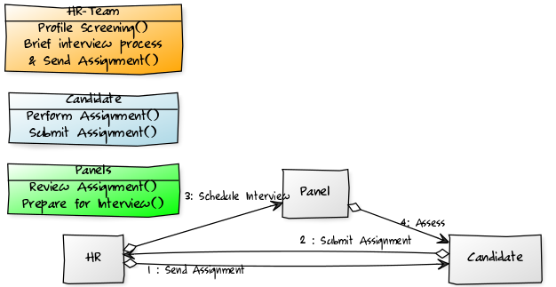

# Technical Competency Evaluation

## Executive Summary

Hiring senior level talent is a hard challenge and traditional methods like hour long point specific querying is unreliable as they can be based on rote replies or does not translate to future performance. On the other hand scenario based questioning take longer time and there isn't enough time to cover wide variety of competencies in just about an hour.

To avoid this problem, We can purse a _multi phased technical evaluation_, with at least two phases. One of them can be focused purely on technical competency and other based on behavioural competency on technical aspects. The emphases on the second part should be based on the [S.T.A.R][1](#References).
technique.

## Technical Evaluation Methodology

The first phase of the technical evaluation can be conducted completely offline and the candidate can choose their own convenience to complete this activity. There are multiple ways of conducting this phase. This can be either through online means or through offline activity followed by a write up of the activity.

### Offline Evaluation Activity

Technical evaluation of skills in an offline activity allows the candidate to choose their convenient time and leverage all their skills at their disposal to arrive at their conclusions.

Let us see, how we can use this technique to hire a cloud engineer.  The potential candidate can be provided with a set automated script (_say cloudformation stack for AWS, ARM template for Azure or maybe a terraform template_). This template should be designed specially to challenge the skills required for that role.
For examples can be,

- It can be seeded with bugs
- Few services misconfigured deliberately
- Use legacy services or poor security controls
- Not follow best practices etc.

The candidate can then be asked to fix or improve the environment provided in the template, following which they will also have to provide a written summary. The summary should include the steps they would recommend and why. To make it more challenging there can be a time window provided to the candidate to complete this exercise. Candidates should be provided with the freedom to document in the format of their choosing.

If we are to extend the same logic to more senior level positions say _Cloud Architect_. Then the written summary will need to include topics like, What would the candidate recommend for best practices for future growth based on industry trends while complying with growing security concerns.

 Based on this documentation, the interviewer will be able to evaluate quickly if the candidate possess the required skills for the given position. The follow up behavioural phase of the discussion can be more productive for the organisation.

### Behavioural Evaluation

In this discussion, the interviewer can expend time on the exercise; follow up on any interesting or missing findings to dive deeper but not rely solely on the activity alone. The remainder of the time can be focused on scenarios[2](#References) like,

- When you worked on multiple projects how did you prioritise?
- Have you ever made a mistake? How did you handle it?
- Have you had to convince a team to work on a project they weren't thrilled about? How did you do it?

In these discussion the candidate can be asked to explain the technical scenario based on the `STAR` technique. This will give the interviewer the ability to judge the candidate's competency along with the capability to build and work with a team.

### Conclusions

As this approach is the least effort intensive and cost conscious, it will be readily adopted to improve the competency building efforts within the organisation.

#### References

1. [Wiki S.T.A.R](https://en.wikipedia.org/wiki/Situation,_task,_action,_result)
2. [Behavioral Questions](https://www.thebalancecareers.com/behavioral-job-interview-questions-2059620)